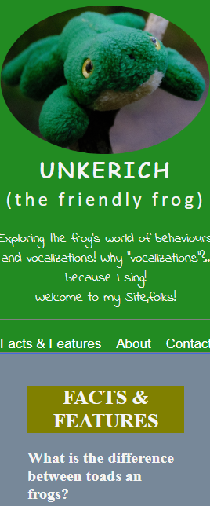

# Unkerich: The friendly frog website (PP1)

### The captured image of the website:

When I first submitted this project, I didn't realize that the folders of the css was not properly linked. Now here it is.
I just hope it goes upon deployment.

This is a Website about frogs and owned by a frog, whose name is Unkerich. This is designed to be an informative website about all frogs.

### How did I do this website?

I started by preparing the images I wanted to put in it. Two images I got - one to be a background image for the body element which I got for free from [Pixabay](https://pixabay.com), but I am not able to use it. The Logo, which is the picture of Unkerich is uniquely taken by our own camera and I worked on it pixel sizes through the use of the open-source [Gimp](https://www.gimp.org).

The very beginning, I had a hard time adjusting the resolution and pixel of the logo for different screens. Aside from that, I was not yet fully decided or sure of the image of Unkerich that I chose - These really took my time for even days. 

Then, as how I learned the organization of the process to build a website, I did it so that way. 

- Creating the main sections of the index file
- Styling each section
- Adding the other webpages based on the index file
- Adding the contents
- All should be tested first on moble screens, then to the larger ones
- Each change should be committed including this README file until the deployment of the website

This is just the run-through or the beginning of this website. There are many things I want to change and add to this later on. Thank GOD!
